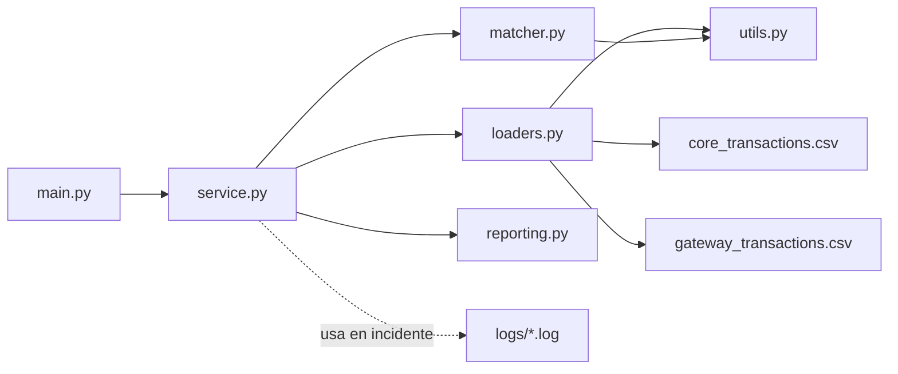

# Plantilla Mermaid - Dependencias

```mermaid
flowchart LR
    M["main.py"] --> S["service.py"]
    S --> L["loaders.py"]
    S --> MT["matcher.py"]
    S --> R["reporting.py"]
    L --> U["utils.py"]
    MT --> U
    L --> C1["core_transactions.csv"]
    L --> C2["gateway_transactions.csv"]
    S -. "usa en incidente" .-> LG["logs/*.log"]
```
