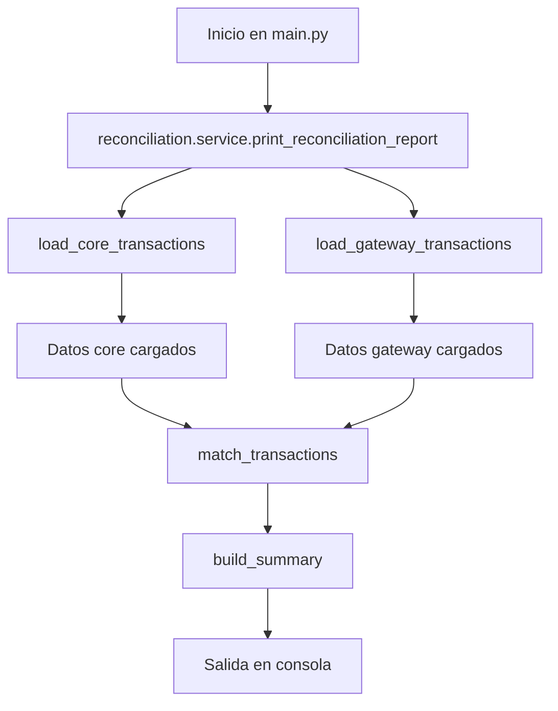

# Plantilla Mermaid - Flujo principal

```mermaid
flowchart TD
    A["Inicio en main.py"] --> B["reconciliation.service.print_reconciliation_report"]
    B --> C["load_core_transactions"]
    B --> D["load_gateway_transactions"]
    C --> E["Datos core cargados"]
    D --> F["Datos gateway cargados"]
    E --> G["match_transactions"]
    F --> G
    G --> H["build_summary"]
    H --> I["Salida en consola"]
```
