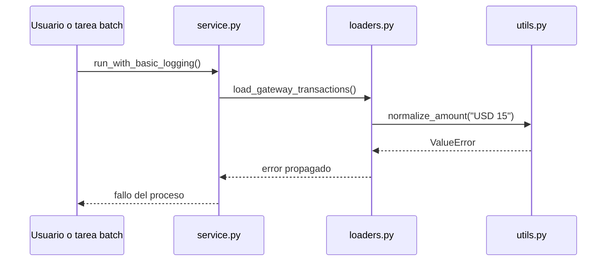

# Plantilla Mermaid - Incidente

```mermaid
sequenceDiagram
    participant User as Usuario o tarea batch
    participant Service as service.py
    participant Loader as loaders.py
    participant Utils as utils.py

    User->>Service: run_with_basic_logging()
    Service->>Loader: load_gateway_transactions()
    Loader->>Utils: normalize_amount("USD 15")
    Utils-->>Loader: ValueError
    Loader-->>Service: error propagado
    Service-->>User: fallo del proceso
```
